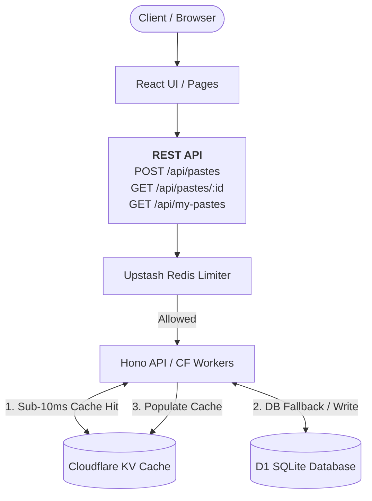

<h1 align="center">
   InkDrop
</h1>

InkDrop is an enterprise-grade, serverless snippet sharing platform built for developers. It offers a secure, high-performance environment to store, manage, and share code, logs, and text using unique URLs.

## Features

### Core Platform
- **Instant Snippet Sharing:** Create, view, and delete pastes instantly without account friction.
- **Rich Text Support:** Native syntax highlighting for JavaScript, Python, SQL, HTML, CSS, JSON, and Plain Text.
- **Granular Access Control:** Toggle pastes between Public, Unlisted, or securely Password-Protected.
- **Automated Expirations:** Set TTLs (Time-To-Live) for 1 hour, 1 day, 1 week, or Never.
- **Burn-After-Reading:** High-security self-destructing pastes that vanish permanently after one view.
- **User Dashboard:** Login via GitHub or Google to manage and delete personal snippets.

### Advanced Backend Systems
- **Adaptive Rate Limiting (Edge):** Protected by Upstash Redis sliding-window algorithms at the Cloudflare Edge to prevent API abuse (strict creation limits, generous read limits).
- **Automated Garbage Collection:** Cloudflare Cron Triggers periodically sweep and purge expired database records.
- **Edge Caching (SWR):** Read-heavy requests are served with sub-10ms latency using Cloudflare KV.
- **OAuth Identity Management:** Secure, sessionless GitHub and Google authentication flows.

### Future Scope
- **Zero-Knowledge Encryption (E2EE):** AES-GCM client-side encryption where the server never sees the plaintext.
- **Custom Vanity URLs:** Developer-friendly custom endpoints.
- **Developer API & CLI:** Native terminal piping support (`cat error.log | inkdrop`).
- **Cloudflare R2 Object Storage:** Signed URL uploads for attaching images and files to pastes.

## Technology Stack

**Frontend**
- React 19 + Vite (TypeScript)
- TailwindCSS v4 (Brutalist "Government" UI Design)
- React Router DOM

**Backend (Serverless)**
- Cloudflare Workers (Edge Compute)
- Hono (Web Framework)
- Upstash Redis (Rate Limiting)

**Database & Storage**
- Cloudflare D1 (Serverless SQLite)
- Cloudflare KV (Low-latency Edge Cache)

## Architecture & Data Flow

InkDrop operates on a globally distributed serverless architecture, ensuring zero cold starts and immense scalability.



## Local Development Setup

### Prerequisites
- Node.js & npm
- Cloudflare Wrangler CLI

### Getting Started

1. Clone the repository:
   ```bash
   git clone https://github.com/AryanSharma48/inkdrop.git
   cd inkdrop
   ```

2. Install dependencies:
   ```bash
   npm install
   ```

3. Run the development server (Starts Wrangler & Vite):
   ```bash
   npm run dev
   ```

## Project Structure

```text
inkdrop/
├── frontend/        # React application (Vite)
├── backend/         # Hono API & Middleware (CF Workers)
├── docs/            # Architecture PRDs
├── schema.sql       # D1 Database Schema
├── wrangler.toml    # Infrastructure as Code config
└── package.json     # Monorepo dependencies
```

## License
ISC
